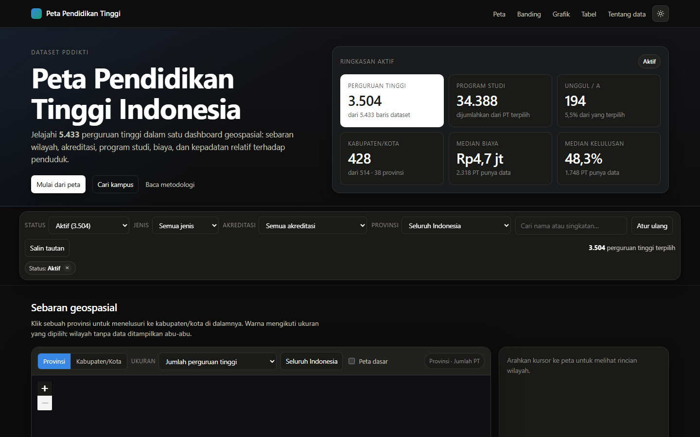
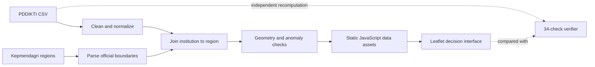

<div align="center">

# Peta Pendidikan Tinggi Indonesia

**A geospatial intelligence system for exploring Indonesian higher-education data with explicit, independently verified data-quality rules.**

[Live dashboard](https://perguruan-tinggi-indonesia-nu.vercel.app/) · [Data methodology](https://perguruan-tinggi-indonesia-nu.vercel.app/tentang-data.html)


</div>



## The decision problem

Public higher-education data is useful only when people can compare institutions across geography, accreditation, study programs, cost, and outcomes without hiding gaps in the source data. This project turns a raw PDDIKTI dataset into an interactive, auditable dashboard while preserving uncertainty and known defects.

## Evidence at a glance

| Signal | Verified scope |
|---|---:|
| Source records | 5,433 institutions |
| Administrative reference | 38 provinces · 514 regencies/cities |
| Independent validation | 34 checks |
| Runtime model | Offline-first static application |

The dashboard supports national-to-local exploration, campus search, regional comparison, distribution charts, and data-quality notes for every important transformation.

## System design



The verifier recomputes results directly from the raw CSV without importing the production transformation modules. That separation prevents a defect in the main pipeline from validating itself.

## What the system delivers

- Province and regency/city exploration with optional basemaps.
- Filters for institution status, type, accreditation, location, cost, and outcomes.
- Comparison views for geographic and institutional indicators.
- A fully static deployment that can run without a backend.
- Explicit annotations for missing, suspicious, or non-comparable values.
- Vendored Leaflet assets so the core experience works offline.

## Data integrity by design

The pipeline does not silently discard inconvenient records.

- PDDIKTI's older 34-province classification is reconciled against the current 38-province reference using official regency/city codes.
- Suspicious tuition values are flagged; impossible values are excluded only from affected statistics.
- Old and new accreditation schemes are grouped for comparison while original labels remain visible.
- Geographic boundaries are cross-checked against independent coordinates.
- Regions with too few observations are not colored for median-based measures.

## Run locally

```bash
git clone https://github.com/akbaralqahri/PerguruanTinggiIndonesia.git
cd PerguruanTinggiIndonesia
npm start
```

Open `http://localhost:8791`. You can also open `site/index.html` directly because the generated data is loaded as JavaScript variables instead of browser `fetch()` requests.

## Rebuild and verify

```bash
npm run build
npm run verify
```

The first build downloads the official regional SQL reference into `build/.cache/`. The generated site assets are written to `site/data/`.

## Data sources

| Data | Source |
|---|---|
| Institutions | PDDIKTI source dataset in `pddikti_pt_gabungan.csv` |
| Administrative boundaries, population, area | [cahyadsn/wilayah](https://github.com/cahyadsn/wilayah), based on Kepmendagri No. 300.2.2-2138/2025 |
| Map interface | [Leaflet 1.9.4](https://leafletjs.com/) |

## Repository map

```text
build/
  build.js          production data pipeline
  verify.js         independent verification
  lib/              parsing, cleaning, matching, and geometry modules
site/
  index.html        dashboard entry point
  tentang-data.html methodology and quality notes
  assets/           interface code and styles
  data/             generated static datasets
  vendor/           vendored Leaflet assets
```

## Known limitations

- Outcome and tuition fields are missing for a substantial share of source records.
- Sixty-eight rows have no regency/city value and cannot appear in the local map view.
- Several source boundaries and coordinates require documented corrections.
- The dashboard is an analytical interface, not an official PDDIKTI service.

---

Built by [Muhammad Ali Akbar Al-Qahri](https://github.com/akbaralqahri) as a data-engineering and geospatial decision-support case study.
